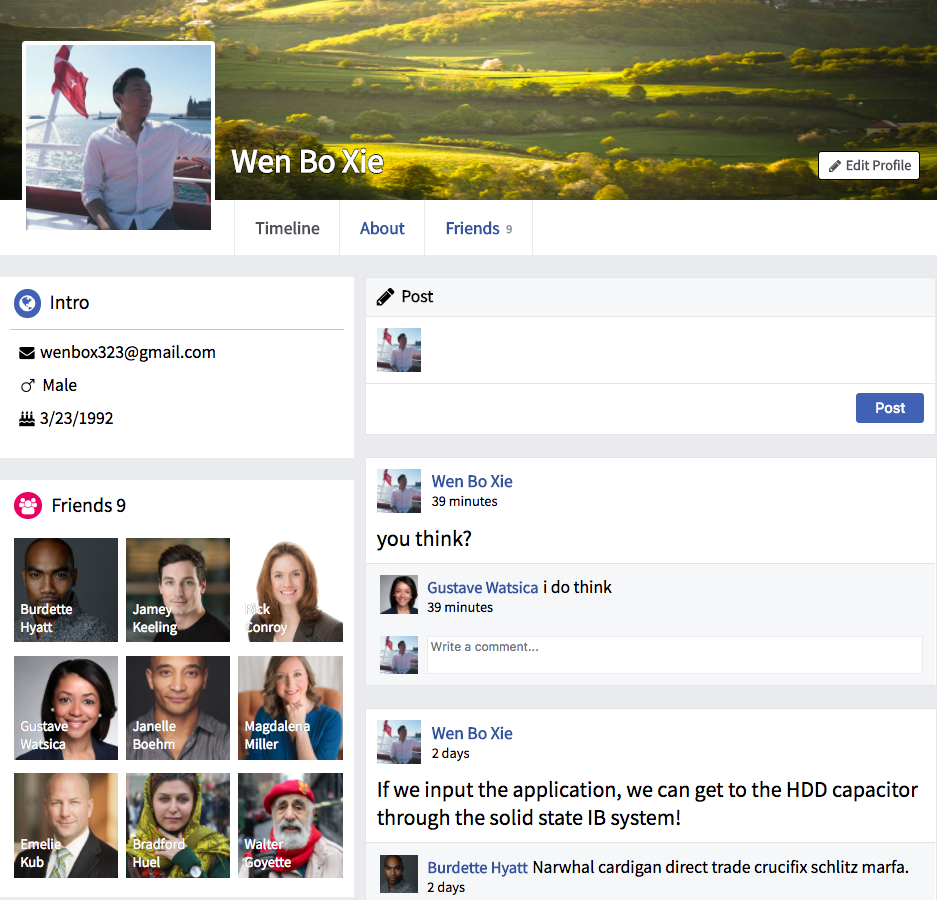
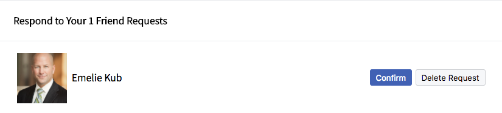

# WenBook

[WenBook live][heroku]

[heroku]: https://wenbo.herokuapp.com/

WenBook is a full-stack social networking web application inspired by Facebook. It incorporates a Ruby on
Rails backend, a PostgreSQL database, and a React.js front end with a Redux architectural framework for state management.

## Features & Implementation

### Profiles

A profile is created on the user's behalf upon account creation to house all personal details about the user, including friendships as well as a timeline of private posts.



The entirety of the user profile is held within the ```DetailPage``` container and will give the user access to three tabs:

1. **Timeline**: Introductory information about a user, display the first nine friends of a user, and all the posts comments by the user or the user's friends.

2. **About**: Tabs containing information about the user and the ability to add and edit said information.

3. **Friends**: Overview of all the user's friends and the ability to act upon the friendship (e.g. unfriend).
t
### Friends

A user has the ability to request, confirm, deny, and delete a friendship. To make this possible, the ```status``` column defaults to 0 but will change based on updated actions. An enumeration is established in the ```Friendship``` model to make the status more readable:

```ruby
  enum status: {
    pending: 0,
    confirmed: 1,
    denied: 2,
    deleted: 3,
  }
```

A user, the sender, can request another user, the receiver, as a friend. However, the recipient of the request can either confirm or deny the friend request.



In order to find all of the pending requests a user needs to sign off on, the Active Record association looks like this:

```ruby
has_many :pending_received_friendships,
  -> { where(status: :pending) },
  class_name: :Friendship,
  foreign_key: :receiver_id
```

### Posts and Comments

Posts are stored with the following columns:

- ```id```
- ```author_id```
- ```receiver_id```
- ```body```

The differentiation between a news feed post and a timeline/wall feed post relies on the ```receiver_id```. If a user or a user's friends wants to post on a timeline/wall feed, then the ```receiver_id``` will be the ```id``` of the user profile (e.g ```profile_id: 1```). Otherwise, when the post is on a news feed, then the ```receiver_id``` is ```nil```. This is an efficient way to implement ```Post``` functionality using a single table while fetching the correct data based on the right criteria.

Comments are implemented using polymorphism because they can belong to more than just posts. For now, a comment only belongs to a ```Post``` with the expectation of expanding to other models as additional features are incorporated that will allow commenting.

### Timelines/Wall Feeds and News Feeds

The Timeline/Wall Feed and News Feed contain all of the user's private and public posts and comments.

Timeline/Wall Feed:

1. User can post a status update on his or her wall as well as comment on any and all all posts.
2. User's friends can post and comment on the user's wall.

News Feed:

1. User can post to his or her news feed, thus updating all of his or her friends' news feeds.
2. User, and all of the user's friends, can comment on any and all posts on the news feed.

This is accomplished by fetching the correct data from the database and displaying it in the shared presentational component ```Feed```.

## Future Directions for this project

Moving Forward

Features planned for future implementation include:

- Improved User Experience and Styling
- Messaging
- Search
- Notifications
- Likes
- Nested Comments
- Photo Albums
